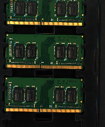
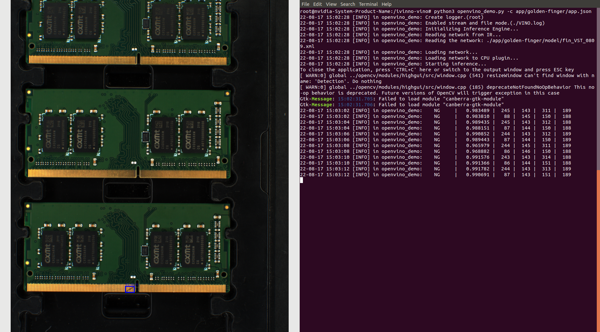
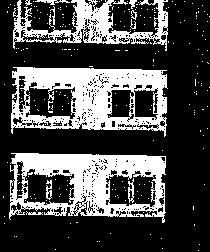
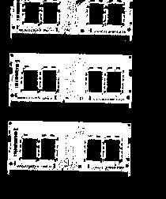
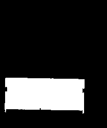
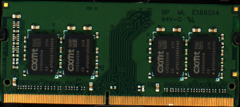
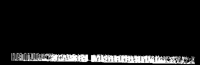
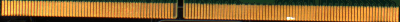
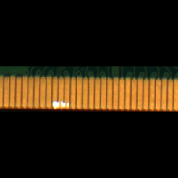

# :factory: AI Factory Detection
**Train a gold finger detection model and deploy on real factory environment.**
 

## Feature
---
- Detect Gold finger decfct on a PCB image or video
- Deployment to Intel platforms
 

## Detection Example
---
###  Original img

### Labeled img

## Dependencies
---
1. Python 3.8.3 (default, Jul  2 2020, 16:21:59)
2. OpenCV 4.1.2.30
3. Intel® Core™ i5-7500 CPU @ 3.40GHz × 4

## How to use
---
### Build Dockerfile
    ./build.sh
### Choose detection file
open app.json and change **"input_data"** location.
    
    {
    "application": "object detection",
    "category": "sample",
    "framework": "openvino",
    "input_data": "app/golden-finger/LUCID_TRI050S-C_183700028__20220815150751168_video1.avi",
    "prim": {
        "model_json": "./app/golden-finger/yolo.json"
    },
    "app_name": "golden-finger",
    "input_type": "V4L2"
}
### Run container
    ./docker/run.sh -f openvino
    python3 openvino_demo.py -c app/golden-finger/app.json
 

## About image process code 
---

### 1. Grab PCB image in original image
* Original img 

* Color in range 

* Remove noises on the msak 

* Calculate counter area and find PCB location 

* Cut pcb on original image 

### 2. Grab gold finger in PCB image
- original pcb image 

- get gold finger mask 

- Cut gold fonger on each pcb 

### 3. Cut photo into equal parts
- original  gold fonger image 

- To be trained by yolov4, we cut and resize those images. 
In this task, we resize the images size to 608*608. 

## Reference
---
