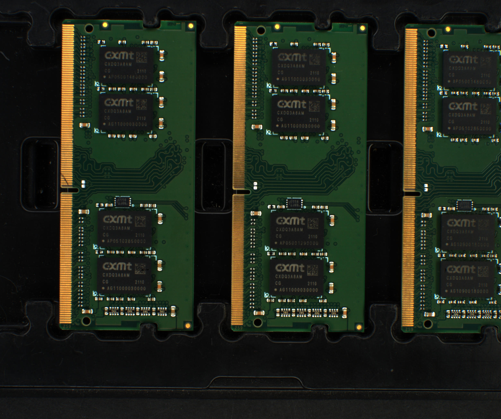

# :factory: AI Factory Detection
**Develop a machine learning model capable of detecting gold fingers and deploy it in a real-world factory environment.**

# Feature

- Develop an image or video analysis system using machine learning techniques to detect defects in gold fingers on printed circuit boards (PCBs).
- Deploy the gold finger defect detection system on Intel platforms for optimal performance and efficiency.

# Detection Example

- Original img 

- Labeled img(image be rotated) 

## Table of Contents

- [Feature](#feature)
- [Maintainers](#maintainers)
- [Dependencies](#dependencies)
- [How to use](#how-to-use)
    - [Build Dockerfile](#build-dockerfile)
    - [Choose detection file](#choose-detection-file)
    - [Run container](#run-container)
- [About image process code](#about-image-process-code)
- [License](#license)

# Dependencies
1. Python 3.8.3 (default, Jul  2 2020, 16:21:59)
2. OpenCV 4.1.2.30
3. Intel® Core™ i5-7500 CPU @ 3.40GHz × 4

# How to use

## Build Dockerfile
    $ ./build.sh
## Choose detection file
open app.json and change **"input_data"** location.
    
    {
    "application": "object detection",
    "category": "sample",
    "framework": "openvino",
    "input_data": "app/golden-finger/LUCID_TRI050S-C_183700028__20220815150751168_video1.avi",
    "prim": {
        "model_json": "./app/golden-finger/yolo.json"
    },
    "app_name": "golden-finger",
    "input_type": "V4L2"
}
## Run container
    $ ./Golden-finger-detecion./docker/run.sh -f openvino

## Run openvino_demo.py
    $ cd Golden-finger-detecion
    $ python3 openvino_demo.py -c app/golden-finger/app.json
    

# About image process code 

## 1. Grab PCB image in original image
* Original img 

* Green in the range(image be rotated) 

* Remove noises on the mask 

* Calculate counter area and find PCB location 

* Cut pcb on original image 

### 2. Grab gold finger in PCB image
- original pcb image 

- get gold finger mask 

- Cut gold fonger on each pcb 

## 3. Cut photo into equal parts
- original  gold fonger image 

- To be trained by yolov4, we cut and resize those images. 
In this task, we will be resizing the images to a size of 608x608 pixels.. 

# Reference

# Maintainers
[@Johnny-Hu-406](https://github.com/Johnny-Hu-406)

# License
[MIT](LICENSE) @Johnny-Hu-406
